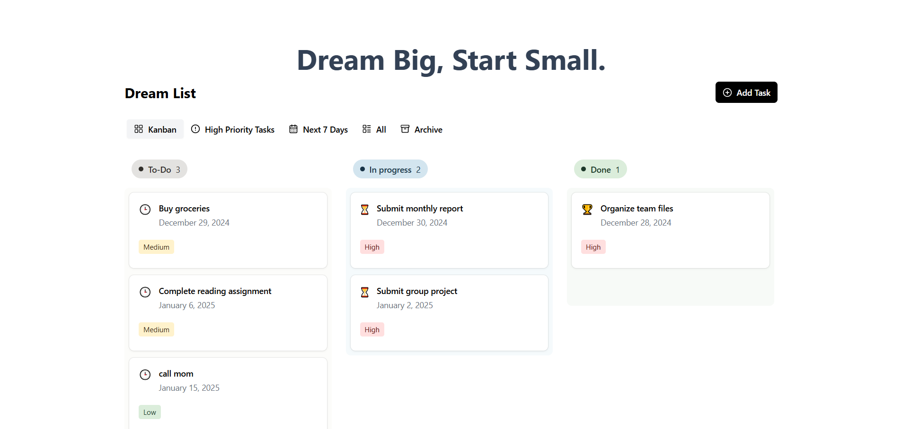

# Dreamline - Transform Your Goals Into Reality. By Peter Odejobi.

A modern task management application that guides you through personal metamorphosis and evolution, turning aspirations into achievable milestones.


[Watch Demo Video](https://drive.google.com/file/d/1wQbzn0mQ8Atezl9neBjBX9UuX_Q52Vq8/view?usp=sharing)


## 🦋 Theme Alignment: Metamorphosis & Evolution

Dreamline embodies themes of transformation and personal growth:

### Metamorphosis & Evolution
- Tasks evolve through stages (Todo → In Progress → Done)
- Visual Kanban board represents stages of transformation
- Archive system maintains history of growth
- Priority levels reflect evolving importance

### Emotional Journey
- Motivational quotes provide emotional support
- Color psychology in UI reflects different states:
  - Warm tones (Todo): Beginning and potential
  - Cool blues (In Progress): Focus and determination
  - Fresh greens (Done): Achievement and growth

### Beauty of Change
- Smooth animations visualize transitions
- Intuitive drag-and-drop represents fluid change
- Multiple views celebrate different aspects of progress

## 🤖 GitHub Copilot Integration

GitHub Copilot enhanced development through:
- Smart component suggestions
- Animation implementations
- Type safety recommendations
- Code optimization hints
- Real-time debugging assistance

## 🚀 Features

- **Kanban Board**: Visual task management
- **Priority Levels**: Task importance tracking
- **Due Dates**: Time management
- **Archive System**: Progress history
- **Responsive Design**: Multi-device support
- **Animations**: Enhanced UX
- **Multiple Views**: Task organization flexibility

## 🛠️ Technical Stack

- Next.js 14
- TypeScript
- Tailwind CSS
- Framer Motion
- Radix UI
- dnd-kit

## 📦 Installation

1. Clone the repository:
```bash
git clone https://github.com/Rinwaoluwa/Dreamline.git
cd dreamline
npm install
npm run dev
```
